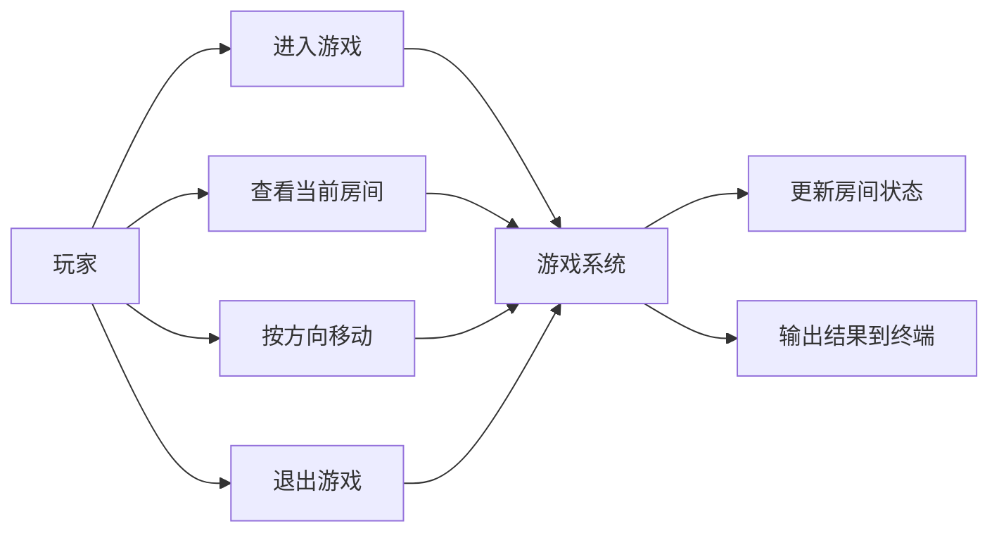
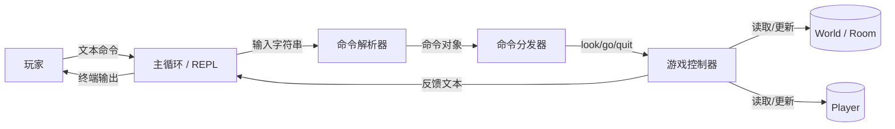

# 📑 需求规格说明书（SRS）更新

> **项目名称**：还是第一版吧 (V1_For_Now)  
> **团队名称**：AAA3A游戏批发  
> **适用阶段**：Sprint 2 需求整理更新

---

## 1.1 核心业务用例图（整理版）

## 1.2 DFD 数据流图（整理版）

## 1.3 SRS 更新要点

1. 新增 `quit` 为正式支持的退出用例。  
2. `look`、`go [north|south|east|west]` 作为 Sprint 2 之前的核心可用命令。  
3. 玩家状态从“无明确对象”升级为“具名实体 + 当前房间指针 + 基础属性”。  
4. 游戏系统对非法输入必须给出统一、友好的错误提示。  
5. 后续 Sprint 2 中的战斗、物品、NPC、掉落等用例，应沿用当前命令分发与领域对象边界，不再把规则写回主循环。
